# Nimbus ERP

Nimbus ERP is a role-based ERP admin panel built with Next.js and shadcn/ui. It brings products, stock, orders, invoices, employees, leaves, suppliers, users and roles together in a single interface.

The project is a frontend-only demo. There is no backend: data is read from JSON files under `src/data`, changes live in memory for the current session, and the session, last login info and printed invoices are kept in the browser's `localStorage`.

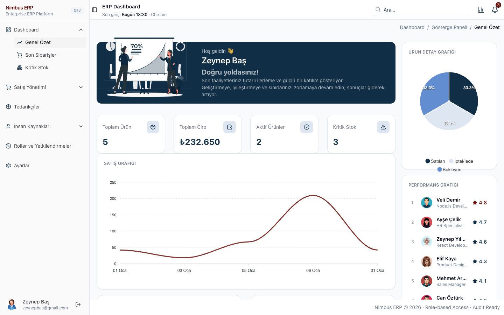

## Features

- **Dashboard** – revenue, product and critical stock cards, sales chart, order status breakdown, top selling products, top rated suppliers, employee performance ranking, employees on leave today and new hires
- **Product and stock management** – product list, product detail and edit panel, critical stock list, inline stock editing in settings, critical stock notifications
- **Order management** – order list, order detail with timeline, edit panel with partial cancel / return, print and PDF output
- **Invoices** – printing an order creates an invoice record; invoices can be listed, exported, downloaded as PDF and removed
- **Employee management** – create, update, delete and detail pages with validation, print and PDF output
- **Leave management** – leave list and leave update form with date range checks
- **Supplier management** – create, update, delete and detail pages, supplied products, rating editing
- **Users and roles** – user list and creation, role assignment page restricted to `ADMIN` and `MANAGER`
- **Authentication and access control** – email / password login against demo accounts, protected routes, role-based menu and route access
- **Tables** – sorting, ID search, column visibility, pagination and Excel export
- **Profile settings** – editable profile with photo upload
- **Responsive layout** – collapsible sidebar, mobile navigation and scrollable tables

## Tech Stack

| Area | Technology |
| --- | --- |
| Framework | Next.js 16 (App Router), React 19, React Compiler |
| Language | JavaScript |
| Styling | Tailwind CSS 4, tw-animate-css |
| UI | shadcn/ui, Radix UI, Lucide icons, cmdk |
| Tables | TanStack Table |
| Charts | ApexCharts (react-apexcharts) |
| Export | SheetJS (xlsx), jsPDF, jspdf-autotable, react-to-print |
| Notifications | Sonner |

## Architecture

- `src/app` contains routes only. Each page renders a component from `components/features`.
- Every module has its own folder under `components/features` holding its table, detail view, forms, column definitions and Excel mapping.
- Shared building blocks live in `components/common` (`DataTable`, `RowActions`, `FormSheet`, `EditDialog`, `TextField`, `StatusBadge`), while `components/ui` holds the shadcn/ui primitives.
- List state is handled by the `useList` hook and form state by `useForm`; nested fields are updated with path expressions such as `address.city`.
- Role and route rules are defined in `constants/roles.js` and enforced in `lib/auth.js`. The current user is read through `useCurrentUser`, which subscribes to `localStorage` changes and always resolves the role from the account record.
- Excel and PDF libraries are loaded on demand, only when an export is triggered.

Access control runs entirely in the browser and is meant for demonstration. A production deployment needs server-side authentication and authorization.

## Screenshots

| Login | Dashboard |
| --- | --- |
| 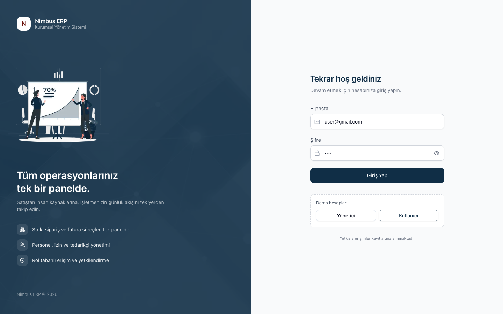 |  |

| Products | Critical Stock |
| --- | --- |
| 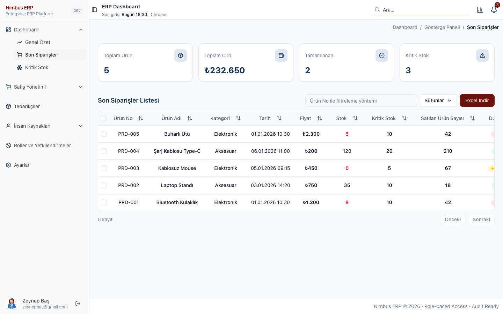 | 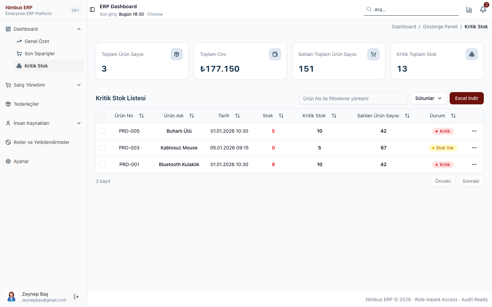 |

| Orders | Order Detail |
| --- | --- |
| 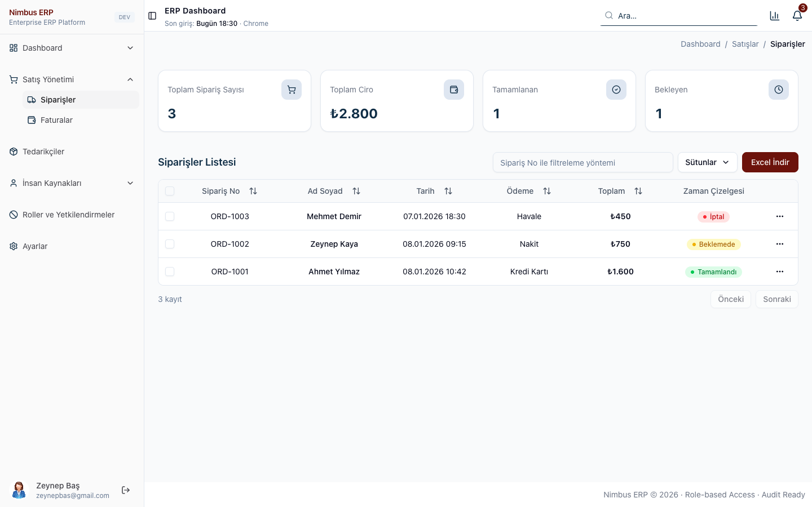 | 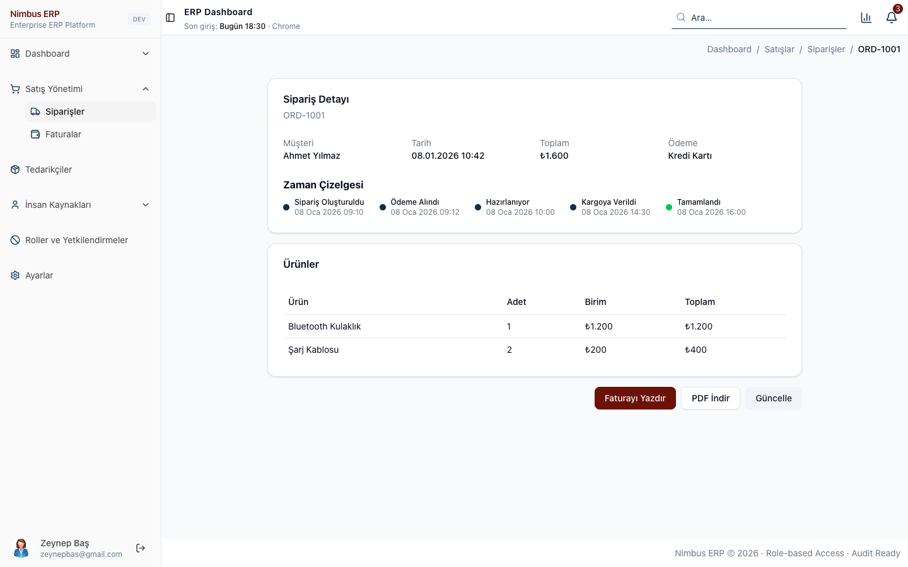 |

| Invoices | Suppliers |
| --- | --- |
|  | 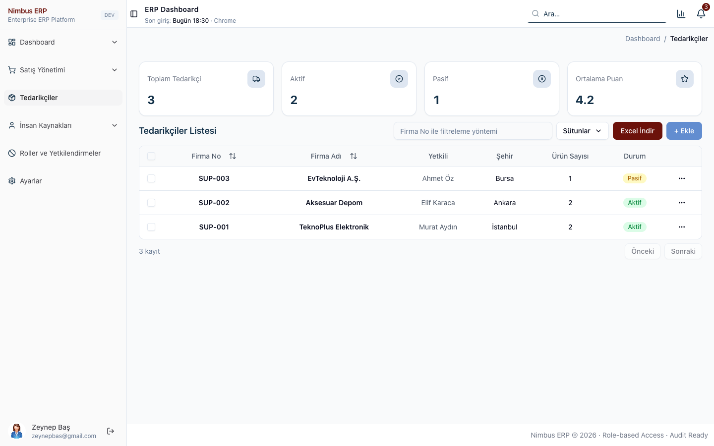 |

| Employees | Leaves |
| --- | --- |
| 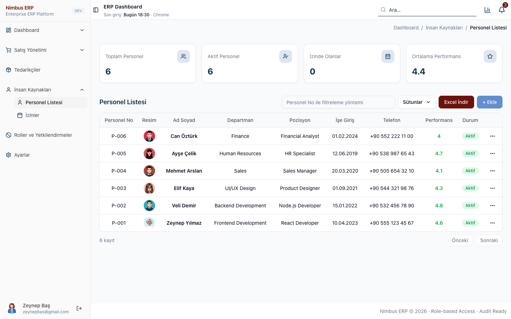 | 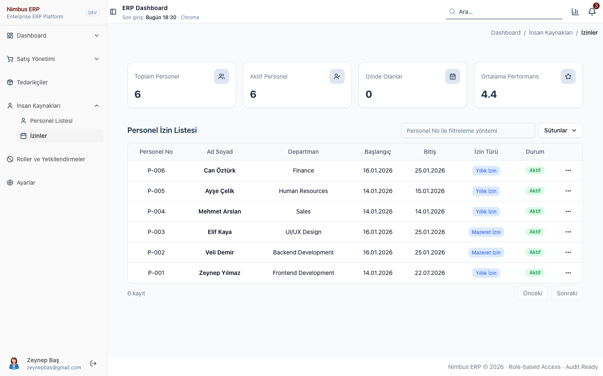 |

| Roles | Settings and Users |
| --- | --- |
| 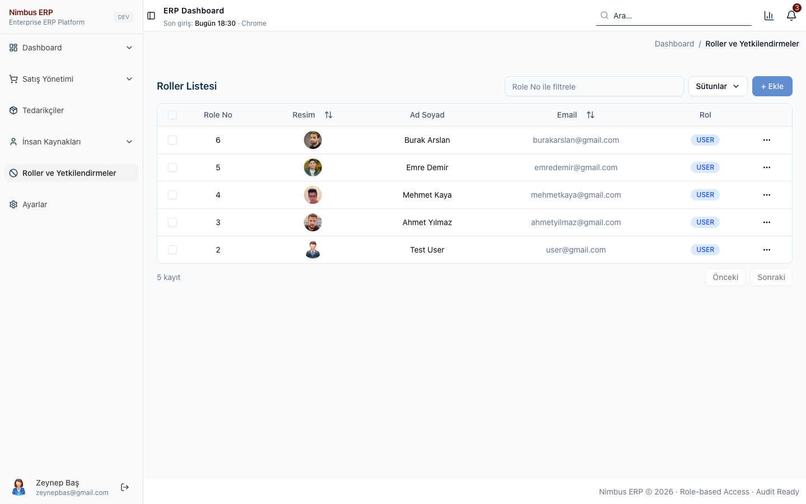 | 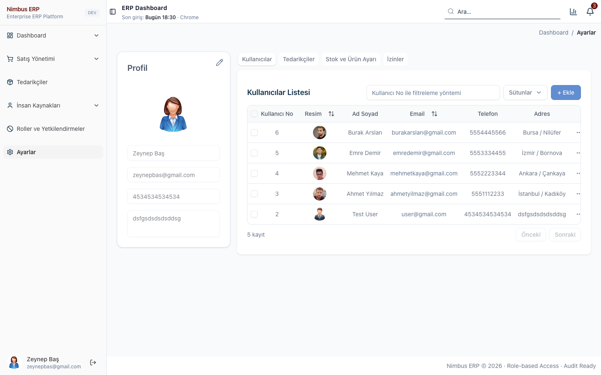 |

## Getting Started

Node.js 20.9 or later is required.

```bash
npm install
npm run dev
```

The app runs at `http://localhost:3000`.

| Command | Description |
| --- | --- |
| `npm run dev` | Starts the development server |
| `npm run build` | Creates a production build |
| `npm start` | Serves the production build |

### Demo accounts

Accounts are defined in `src/data/users.json`. Every account uses the password `123`.

| Role | Email | Access |
| --- | --- | --- |
| `MANAGER` | `zeynepbas@gmail.com` | All modules, including role management |
| `USER` | `user@gmail.com` | All modules except role management |

## Project Structure

```
src
├── app
│   ├── (auth)              Login page
│   └── (protected)         Pages that require a session
│       ├── dashboard       Summary, product list, critical stock
│       ├── sales           Orders, invoices
│       ├── supplier        Suppliers
│       ├── humanresources  Employees, leaves
│       ├── role            Role management
│       └── settings        Profile, users, supplier ratings, stock, leaves
├── components
│   ├── ui                  shadcn/ui primitives
│   ├── common              Shared table, form, dialog and card components
│   ├── layout              Sidebar, header, search, notifications, breadcrumb
│   ├── charts              Chart components
│   └── features            Module components (auth, dashboard, products, orders,
│                           invoices, employees, leaves, suppliers, users, roles, settings)
├── config                  Menu definition
├── constants               Roles, statuses and storage keys
├── data                    Sample data (JSON)
├── hooks                   useList, useForm, usePrint, useCurrentUser, useIsMobile
└── lib                     Auth, storage, formatting, validation, PDF and Excel helpers
```

